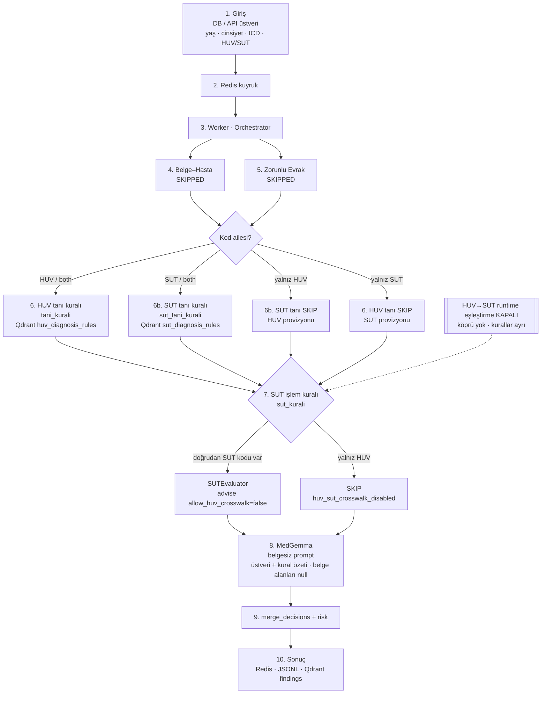

# Belgesiz Provizyon Değerlendirme Akışı

Yeni / yeniden kuyruğa alınan **belgesiz** işler (`documents_mode=skipped_full_pipeline`)
aşağıdaki pipeline ile değerlendirilir.

**Önemli (2026-07):** Runtime **HUV→SUT eşleştirmesi kapalıdır**.
HUV kuralları ve SUT kuralları **ayrı** çalışır. Katalog dosyası
(`huv_sut_crosswalk.jsonl`) diskte durur; canlı değerlendirmede HUV kodu
SUT’a çevrilmez. Geri açmak: `PROVIZYON_ENABLE_HUV_SUT_CROSSWALK=1` + API/worker restart.

İlgili: [`PROVIZYON.md`](../PROVIZYON.md) · bayrak: `OrchestratorConfig.enable_huv_sut_crosswalk`

---

## Baştan sona diyagram

---

## Katman özeti (belgesiz)

| Adım | Katman | Belgesiz davranış |
|---|---|---|
| 4 | `belge_hasta` | **SKIPPED** (hata değil) |
| 5 | `zorunlu_evrak` | **SKIPPED** (hata değil); HUV→SUT ile evrak aranmaz |
| 6 | `tani_kurali` | HUV kodu varsa **çalışır** |
| 6b | `sut_tani_kurali` | Doğrudan SUT kodu varsa **çalışır** |
| 7 | `sut_kurali` | Doğrudan SUT → **çalışır**; yalnız HUV → **SKIP** (`huv_sut_crosswalk_disabled`) |
| 8 | `medgemma` | **Çalışır** (görsel yok; metin/üstveri) |
| 9 | merge | Soft/skip REVIEW + belgesiz `medium\|high` → uygun yolu açık |

---

## Ne bozulmaz / ne değişmez

- HUV ICD tanı motoru aynı
- SUT ICD tanı + SUT işlem kuralları (doğrudan SUT) aynı
- MedGemma, persistence, risk birleştirme aynı
- Sadece HUV kodunu SUT’a çevirip SUT kuralına/zorunlu-evraka sokma yolu kapalı

Eski bitmiş sonuçlar diskte eski değerlendirmeyi tutar; yeni davranış için
yeniden enqueue gerekir.
